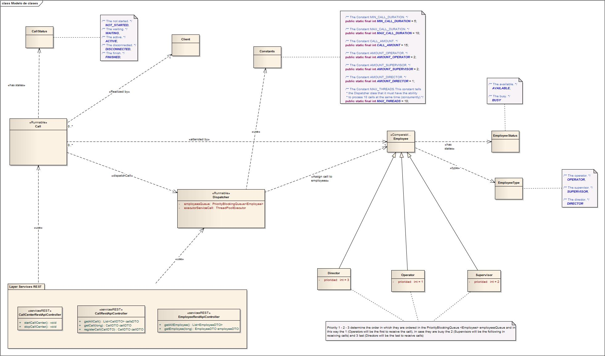
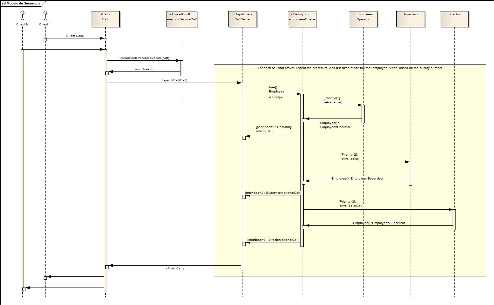
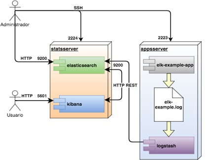

# Classes and Domain Diagram:

## Class Call:
The Call class implements the Runnable interface and the Thread is created by the ThreadPoolExecutor class. This Call class has all the behavior of a call. It is also responsible for calling the dispatchCall method, so that the Dispatch can assign an employee of the callCenter and attend said call.

This run method is executed when the call is generated, that is, when the customer dials the call center from their telephone.
This thread will start with the start method and then the run method will be called, in this way the call runs like a thread.
The call to the callcenter was initiated by the client, this means that he marked the number of the call center and pressed the button of his telephone call.
The call center (Dispatcher) assigns you a unique call number or ticket

The states of the calls:

* NOT_STARTED (the call is being created and it did not start)
* WAITING (the call is waiting to be answered by an employee assigned by the callCenter (Dispatcher))
* ACTIVE (the call is active or is being attended by an employee)
* DISCONNECTED (the call was disconnected by some interruption in the callCenter)
* FINISHED (the call ended successfully with being attended by an employee)

The call has access as a thread to the call of the dispatchCall method of the Dispatcher class (CallCenter). A call has a client with associated data. And it will be attended by a single employee.

## Class Dispatcher:
The Dispatcher class is the Call Center that is responsible for handling the call allocation to call center employees.This class is a thread which is uncovered by other threads that are called through the exposing method called dispatchCall. The Dispatcher (CallCenter) assigns a unique call ID (AtomicLong) to each call

*ThreadPoolExecutor executorServiceCall:*
The executor service call. The Thread Pool pattern helps to save resources in a multithreaded application, and also to contain the parallelism in certain predefined limits. When you use a thread pool, you write your concurrent code in the form of parallel tasks and submit them for execution to an instance of a thread pool. This instance controls several re-used threads for executing these tasks. The pattern allows you to control the number of threads the application is creating, their lifecycle, as well as to schedule tasks’ execution and keep incoming tasks in a queue. In this way we can have 10 concurrent calls (threads) in our callCenter (Dispacht), waiting to be attended by an employee. In case of having more than 10 concurrent calls, the surplus of calls comes to be queued in 
the queue (BlockingQueue) that ThreadPoolExecutor handles, so that then the calls can be taken from that queue and be able to be assigned and be attended by an employee
      
*PriorityBlockingQueue<Employee> employeesQueue:*
The employees queue. Employees will be assigned to a PriorityBlockingQueue queue. This queue handles the priority of pasting, so that the first to leave will be the operators, then the supervisors and, finally, if no one is available, the directors.It is a concurrent queue so that a call can wait for an employee to be all busy, and also take concurrently for several calls at the same time, one employee at a time, managing the concurrency and the block of it.

*List<CallDTO> queryCallsDTO =  new ArrayList<CallDTO>():*
This queryCallsDTO list is used to query from the REST services, call information without affecting the running queue PriorityBlockingQueue <Call>, the queryCallsDTO list is kept up to date and synchronized with PriorityBlockingQueue <Call> that is running on threads
  
*List<EmployeeDTO> queryEmployeesDTO = new ArrayList<EmployeeDTO>():*
This *queryEmployeesDTO* list is used to query from the REST services, employee information without affecting the running queue PriorityBlockingQueue<Employee>, the queryEmployeesDTO list is kept up to date and synchronized with PriorityBlockingQueue <Employee> that is running on threads. 

This method *dispachtCall*, looks for if there is a free employee to be assigned to said call (thread) that has invoke to this method. If there is an available employee, we will take from the employee queue PriorityBlockingQueue to a employee with the method take (Retrieve and remove the head of this queue, waiting if necessary until an element becomes available.) This means in case there is no employee available the call will wait (thread) to reappear an employee in the queue and be available.

## Class Employee:
This class Attend to Call. This class attends the call that is, it is when an employee is assigned to a call from a client. The call goes to active state and the employee has been occupied which was taken out of the employee's queue (PriorityBlockingQueue) because it is busy. It put the call in Active state. Change the status of the call to finished.

# Sequence Diagram:

# Improvements and Functionalities to be added:

## Implements EKL:

In this way we could have json documents of calls with customers and employees to do searches of all kinds in large volume of data.

You could think of a model to analyze the information as EKL:
Elasticsearch, Logstash and Kibana, a centralized system for collecting and analyzing application logs. Elasticsearch, Logstash and Kibana, a centralized system for collecting and analyzing application logs.

To implement a platform of this type, the following elements are required:

1. A logs collection agent in our applications.
This is handled by the Logstash daemon, although as will be seen later, there are other options.

2. A database where to store, index and search the log events of the applications.
For this Elasticsearch is used.

3. A frontend application where users can consult the most interesting events and be
informed of any incident. This is the function of Kibana.

*Elasticsearch* is a product that allows to index and analyze in real time large amounts of data in a distributed manner. Go one step beyond text search thanks to a DSL and an API for more complicated searches.
Elasticsearch allows to store documents (structured or not) and index all the fields of these documents in almost real time.

*LOGSTASH*
As I have already mentioned, Logstash is a channeling tool generally used to collect and forward records or events. It is an open source data collection engine that can dynamically integrate data from various sources and normalize them to the specified destinations.

*KIBANA*
As mentioned above, Kibana is an open source analysis and visualization tool. It helps to visualize the data that is transferred with Logstash and stored in Elasticsearch. You can use Kibana to search, view and interact with these stored data and then view them in various tables, tables and maps. The browser-based interface of Kibana simplifies the huge volumes of data and reflects changes in real time in the Elasticsearch queries. In addition, you can also easily create, customize, save and share your panels.
